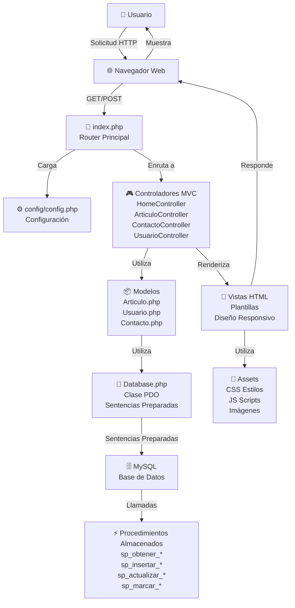

# README - Semana 8: Implementación de PDO y Procedimientos Almacenados

## 📋 Introducción

Este documento describe las mejoras implementadas en el proyecto **"El Faro"** para la Semana 8 de la actividad formativa del Taller de Aplicaciones para Internet.

El objetivo principal fue migrar completamente la aplicación a usar **PDO (PHP Data Objects)** con **sentencias preparadas** y **procedimientos almacenados en MySQL**, manteniendo la arquitectura MVC y todas las funcionalidades existentes.

---

## 🎯 Objetivos Cumplidos

✅ Implementación de PDO en toda la aplicación  
✅ Uso de sentencias preparadas para prevenir inyección SQL  
✅ Creación de procedimientos almacenados en MySQL  
✅ Centralización de configuración en `config/config.php`  
✅ Clase `Database.php` mejorada con métodos reutilizables  
✅ Mantenimiento de arquitectura MVC  
✅ Preservación del diseño visual y responsividad  
✅ Documentación técnica completa  

---

## 📁 Archivos Creados y Modificados

### Archivos Creados

| Archivo | Descripción |
|---------|-------------|
| `config/config.php` | Archivo de configuración centralizado con constantes de BD |
| `database/procedimientos.sql` | Procedimientos almacenados para operaciones de BD |
| `README_SEMANA8.md` | Este documento de documentación técnica |

### Archivos Modificados

| Archivo | Cambios |
|---------|---------|
| `models/Database.php` | Ampliación con métodos reutilizables: `query()`, `bind()`, `execute()`, `resultSet()`, `single()`, `rowCount()`, `lastInsertId()` |
| `models/Articulo.php` | Inclusión de `config/config.php`, documentación mejorada |
| `models/Usuario.php` | Inclusión de `config/config.php`, documentación mejorada |
| `models/Contacto.php` | Inclusión de `config/config.php`, documentación mejorada |
| `index.php` | Inclusión de `config/config.php`, documentación mejorada |

### Archivos Sin Cambios

Se mantuvieron sin cambios los siguientes archivos para preservar funcionalidad:
- Estructura MVC completa
- Controladores: `HomeController.php`, `ArticuloController.php`, `ContactoController.php`, `UsuarioController.php`
- Vistas: `home.php`, `contacto.php`, `usuarios.php`, `registro.php`, etc.
- Estilos CSS: Toda la carpeta `assets/css/`
- Scripts JavaScript: Toda la carpeta `assets/js/`

---

## 🔧 Estructura del Proyecto

```
el-faro-php/
├── config/
│   └── config.php                 # Configuración centralizada (NUEVO)
├── database/
│   ├── procedimientos.sql         # Procedimientos almacenados (NUEVO)
│   ├── database.sql               # Estructura de base de datos
│   └── articulos-muestra.sql      # Datos de ejemplo
├── models/
│   ├── Database.php               # Clase PDO mejorada
│   ├── Articulo.php               # Modelo de artículos
│   ├── Usuario.php                # Modelo de usuarios
│   └── Contacto.php               # Modelo de contactos
├── controllers/
│   ├── HomeController.php         # Controlador de inicio
│   ├── ArticuloController.php     # Controlador de artículos
│   ├── ContactoController.php     # Controlador de contactos
│   └── UsuarioController.php      # Controlador de usuarios
├── views/
│   ├── home.php                   # Vista principal
│   ├── contacto.php               # Formulario de contacto
│   ├── registro.php               # Formulario de registro
│   ├── usuarios.php               # Listado de usuarios
│   ├── resultado_contacto.php     # Resultado contacto
│   ├── resultado_registro.php     # Resultado registro
│   └── layout/
│       ├── header.php             # Encabezado
│       └── footer.php             # Pie de página
├── assets/
│   ├── css/
│   │   └── style.css              # Estilos CSS
│   ├── js/
│   │   └── site.js                # Scripts JavaScript
│   └── media/                      # Imágenes y multimedia
├── index.php                       # Punto de entrada (Router)
├── setup.php                       # Script de configuración inicial
├── README.md                       # Documentación principal
├── README_SEMANA8.md              # Este documento (NUEVO)
└── .git/                           # Control de versiones
```

---

## 🔐 Implementación de PDO

### 1. Configuración Centralizada (`config/config.php`)

Se creó un archivo de configuración centralizado que define constantes para la conexión a la base de datos:

```php
define('DB_HOST', 'localhost');
define('DB_NAME', 'el_faro');
define('DB_USER', 'root');
define('DB_PASS', '');
define('DB_CHARSET', 'utf8mb4');
```

**Ventajas:**
- Fácil mantenimiento
- Cambios de configuración en un solo lugar
- Separación clara de datos sensibles

### 2. Clase Database.php Mejorada

La clase `Database.php` implementa un patrón de abstracción de base de datos con PDO:

#### Métodos Disponibles

```php
// Conectar a la base de datos
$db = new Database();
$connection = $db->conectar();

// Preparar y ejecutar una consulta
$db->query("SELECT * FROM usuarios WHERE id = :id");
$db->bind(':id', 5);
$db->execute();

// Obtener múltiples registros
$usuarios = $db->resultSet();

// Obtener un único registro
$usuario = $db->single();

// Contar filas afectadas
$rowCount = $db->rowCount();

// Obtener último ID insertado
$lastId = $db->lastInsertId();
```

### 3. Sentencias Preparadas

Todos los modelos utilizan sentencias preparadas para prevenir inyección SQL:

```php
// ❌ Método inseguro (EVITAR)
$query = "SELECT * FROM usuarios WHERE email = '$email'";

// ✅ Método seguro con PDO
$db = new Database();
$db->query("SELECT * FROM usuarios WHERE correo = :correo");
$db->bind(':correo', $email);
$usuario = $db->single();
```

---

## 📦 Procedimientos Almacenados

Se implementaron 18 procedimientos almacenados agrupados en 4 categorías:

### Artículos (6 procedimientos)

| Procedimiento | Descripción |
|--------------|-------------|
| `sp_obtener_articulos()` | Obtiene todos los artículos ordenados por fecha |
| `sp_obtener_articulos_por_seccion(seccion)` | Obtiene artículos de una sección específica |
| `sp_obtener_articulos_por_categoria(categoria)` | Obtiene artículos de una categoría específica |
| `sp_obtener_articulo_por_id(id)` | Obtiene un artículo específico por ID |
| `sp_insertar_articulo(...)` | Inserta un nuevo artículo |
| `sp_actualizar_articulo(...)` | Actualiza un artículo existente |

### Usuarios (5 procedimientos)

| Procedimiento | Descripción |
|--------------|-------------|
| `sp_obtener_usuarios()` | Obtiene todos los usuarios activos |
| `sp_obtener_usuario_por_id(id)` | Obtiene un usuario por ID |
| `sp_obtener_usuario_por_correo(correo)` | Obtiene un usuario por correo |
| `sp_insertar_usuario(...)` | Inserta un nuevo usuario |
| `sp_verificar_correo_existente(correo)` | Verifica si un correo ya existe |

### Contactos (4 procedimientos)

| Procedimiento | Descripción |
|--------------|-------------|
| `sp_obtener_contactos()` | Obtiene todos los mensajes de contacto |
| `sp_obtener_contacto_por_id(id)` | Obtiene un mensaje específico |
| `sp_insertar_contacto(...)` | Inserta un nuevo mensaje de contacto |
| `sp_marcar_contacto_leido(id)` | Marca un contacto como leído |

### Estadísticas (1 procedimiento)

| Procedimiento | Descripción |
|--------------|-------------|
| `sp_obtener_estadisticas()` | Retorna estadísticas generales del sitio |

---

## 🚀 Instalación y Configuración

### Requisitos Previos

- XAMPP o similar instalado
- PHP 7.4+
- MySQL 5.7+
- Navegador web moderno

### Paso 1: Descargar el Proyecto

```bash
cd /ruta/a/htdocs  # En Windows: c:\xampp\htdocs
git clone [url-del-repositorio] el-faro-php
cd el-faro-php
```

### Paso 2: Iniciar XAMPP

1. Abre **XAMPP Control Panel**
2. Inicia **Apache**
3. Inicia **MySQL**

### Paso 3: Crear la Base de Datos

#### Opción A: Usando phpMyAdmin

1. Abre `http://localhost/phpmyadmin`
2. Crea una base de datos llamada `el_faro`
3. Importa `database/database.sql`
4. Importa `database/procedimientos.sql`

#### Opción B: Usando línea de comandos MySQL

```bash
mysql -u root -p < database/database.sql
mysql -u root -p < database/procedimientos.sql
```

### Paso 4: Verificar la Configuración

Edita `config/config.php` si es necesario y ajusta:

```php
define('DB_HOST', 'localhost');      // Host de MySQL
define('DB_NAME', 'el_faro');        // Nombre de la BD
define('DB_USER', 'root');           // Usuario MySQL
define('DB_PASS', '');               // Contraseña MySQL
```

### Paso 5: Acceder al Sitio

Abre tu navegador y ve a:

```
http://localhost/el-faro-php/
```

---

## ✅ Pruebas de Funcionamiento

### 1. Verificar Conexión a BD

Crea un archivo `test-conexion.php` en la raíz:

```php
<?php
require_once 'config/config.php';
require_once 'models/Database.php';

try {
    $db = new Database();
    $conn = $db->conectar();
    echo "✅ Conexión exitosa a la base de datos";
} catch (Exception $e) {
    echo "❌ Error: " . $e->getMessage();
}
?>
```

### 2. Prueba del Sitio Principal

1. Ve a `http://localhost/el-faro-php/`
2. Verifica que se cargue correctamente
3. Prueba la navegación entre secciones

### 3. Prueba de Formularios

1. Ve a **Contacto** y envía un mensaje
2. Ve a **Registro** e intenta crear una cuenta
3. Verifica que los datos se guarden en la BD

### 4. Verificar Procedimientos Almacenados

En phpMyAdmin, ve a **Rutinas** y verifica que existan:
- ✅ Todos los `sp_obtener_*` procedimientos
- ✅ Todos los `sp_insertar_*` procedimientos
- ✅ `sp_actualizar_articulo`
- ✅ `sp_marcar_contacto_leido`
- ✅ `sp_obtener_estadisticas`

### 5. Revisar Logs de Errores

Si hay problemas, revisa:

```
C:\xampp\apache\logs\error.log
C:\xampp\mysql\data\[hostname].err
```

---

## 📊 Diagrama de Arquitectura



### Explicación del Flujo

1. **Usuario** realiza una solicitud desde el navegador
2. **index.php** recibe la solicitud y carga **config.php**
3. **Router** dirige la solicitud al **Controlador** apropiado
4. **Controlador** utiliza los **Modelos** para acceder a datos
5. **Modelos** utilizan la clase **Database.php** con PDO
6. **Database.php** envía sentencias preparadas a MySQL
7. **MySQL** ejecuta **Procedimientos Almacenados**
8. Los resultados se devuelven a través del flujo inverso
9. **Controlador** carga la **Vista** apropiada
10. **Vista** utiliza **Assets** (CSS, JS, imágenes)
11. **Navegador** muestra la página al usuario

---

## 🔒 Seguridad Implementada

### 1. Sentencias Preparadas

```php
// Previene inyección SQL
$db->query("SELECT * FROM usuarios WHERE correo = :correo");
$db->bind(':correo', $email);
$usuario = $db->single();
```

### 2. Hashing de Contraseñas

```php
// Password_hash con BCRYPT
$hash = password_hash($password, PASSWORD_BCRYPT);

// Verificación segura
if (password_verify($password, $hash)) {
    // Contraseña válida
}
```

### 3. Sanitización de Entrada

```php
// Uso de htmlspecialchars para evitar XSS
$titulo = htmlspecialchars(trim($_POST['titulo']));
```

### 4. Gestión de Errores con Excepciones

```php
try {
    // Operación de BD
} catch (PDOException $e) {
    // Manejo seguro del error
    error_log("Error: " . $e->getMessage());
}
```

---

## 📝 Ejemplos de Uso

### Ejemplo 1: Obtener Artículos de una Sección

```php
<?php
require_once 'config/config.php';
require_once 'models/Articulo.php';

// Método seguro con sentencias preparadas
$articulos = Articulo::obtenerPorSeccion('noticias');

foreach ($articulos as $articulo) {
    echo $articulo->getTitulo() . "<br>";
}
?>
```

### Ejemplo 2: Crear un Nuevo Usuario

```php
<?php
require_once 'config/config.php';
require_once 'models/Usuario.php';

$usuario = new Usuario(
    'Juan Pérez',
    'juan@example.com',
    'mi_contraseña'
);

if ($usuario->guardar()) {
    echo "Usuario creado exitosamente";
} else {
    echo "Error al crear el usuario";
}
?>
```

### Ejemplo 3: Guardar un Contacto

```php
<?php
require_once 'config/config.php';
require_once 'models/Contacto.php';

$contacto = new Contacto(
    'María López',
    'maria@example.com',
    'Este es mi mensaje'
);

if ($contacto->guardar()) {
    echo "Mensaje guardado correctamente";
} else {
    echo "Error al guardar el mensaje";
}
?>
```

---

## 🐛 Solución de Problemas

### Error: "Error de conexión"

**Causa:** Las credenciales de BD son incorrectas

**Solución:**
1. Verifica que MySQL está corriendo
2. Confirma el usuario y contraseña en `config/config.php`
3. Asegúrate de que la BD `el_faro` existe

### Error: "Table doesn't exist"

**Causa:** No se importó `database.sql` correctamente

**Solución:**
```bash
mysql -u root -p el_faro < database/database.sql
```

### Error: "SQLSTATE[42000]: Syntax error"

**Causa:** Probablemente un error de sintaxis SQL

**Solución:**
1. Revisa `config/config.php` para errores
2. Verifica que `database/procedimientos.sql` se importó correctamente
3. Usa phpMyAdmin para validar los procedimientos

### El sitio no carga (Página en blanco)

**Solución:**
1. Activa errores en `config/config.php`: `define('SHOW_ERRORS', true);`
2. Revisa `C:\xampp\apache\logs\error.log`
3. Usa `test-conexion.php` para verificar la conexión

---

## 📚 Referencias Útiles

### Documentación Oficial

- [PHP PDO Documentation](https://www.php.net/manual/es/book.pdo.php)
- [MySQL Stored Procedures](https://dev.mysql.com/doc/refman/8.0/en/create-procedure.html)
- [XAMPP Documentation](https://www.apachefriends.org/docs/)

### Tutoriales Relacionados

- [PDO Tutorial in PHP](https://www.w3schools.com/php/php_sql_intro.asp)
- [MySQL Procedures Tutorial](https://www.mysqltutorial.org/mysql-stored-procedure/)
- [MVC Architecture in PHP](https://www.tutorialspoint.com/mvc_framework/)

---

## 📅 Historial de Cambios

### Semana 8 (Implementación Actual)

- ✅ Creación de `config/config.php`
- ✅ Mejora de clase `Database.php`
- ✅ Creación de procedimientos almacenados
- ✅ Actualización de modelos
- ✅ Documentación técnica completa
- ✅ Diagrama de arquitectura

---

## 👨‍💻 Autor

**Desarrollado para la actividad formativa:**
- Curso: Taller de Aplicaciones para Internet
- Semana: 8
- Proyecto: El Faro

---

## 📄 Licencia

Este proyecto se desarrolla bajo fines educativos.

---

## ❓ Preguntas Frecuentes

**P: ¿Debo usar procedimientos almacenados en lugar de sentencias preparadas?**  
R: Ambas son seguras contra inyección SQL. Usa ambas según convenga. Los procedimientos son útiles para lógica compleja.

**P: ¿Cómo cambio la contraseña de MySQL?**  
R: Edita `config/config.php` con las nuevas credenciales.

**P: ¿Puedo usar esta clase Database en otros proyectos?**  
R: Sí, es completamente reutilizable. Solo copia `Database.php` y `config.php`.

**P: ¿Qué pasa si se olvida de usar sentencias preparadas?**  
R: Tu sitio será vulnerable a inyección SQL. ¡Siempre usa sentencias preparadas!

---

**Última actualización:** 12 de mayo de 2026  
**Versión:** 1.0
